# Autonomous-ML-based-detection-and-identification-of-root-cause-for-incidents-in-microservices-runnin
## Project 6

___

### Objective:
By the end of this project, you will be able to demonstrate an alternative approach that uses the [Zebrium](https://www.zebrium.com/) machine learning (ML) platform to automatically find root cause in logs generated by an application deployed in Amazon [EKS](https://aws.amazon.com/eks/).

The project will cover:

- Installing the [Sock Shop](https://microservices-demo.github.io/) microservices demo app in an EKS cluster
- Installing Zebrium log collector
- Breaking the demo app (using a chaos engineering tool) and verifying that the Zebrium platform automatically finds the root cause

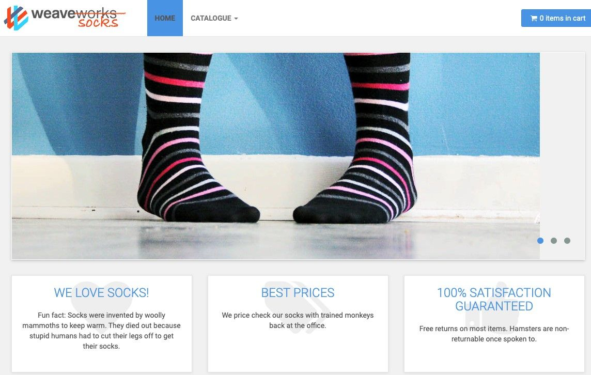

### Requirements
1. An active AWS account.
2. AWS CLI with the IAM user having admin permission or having all the permissions to execute the setup.
3. A free [Zebrium](http://www.zebrium.com/sign-up) trial account.

### Step 1. Install the latest version of AWS CLI 

* Sign-in through your IAM user account.
* Make sure that your permissions for your "User" is set to "AdministratorAccess".

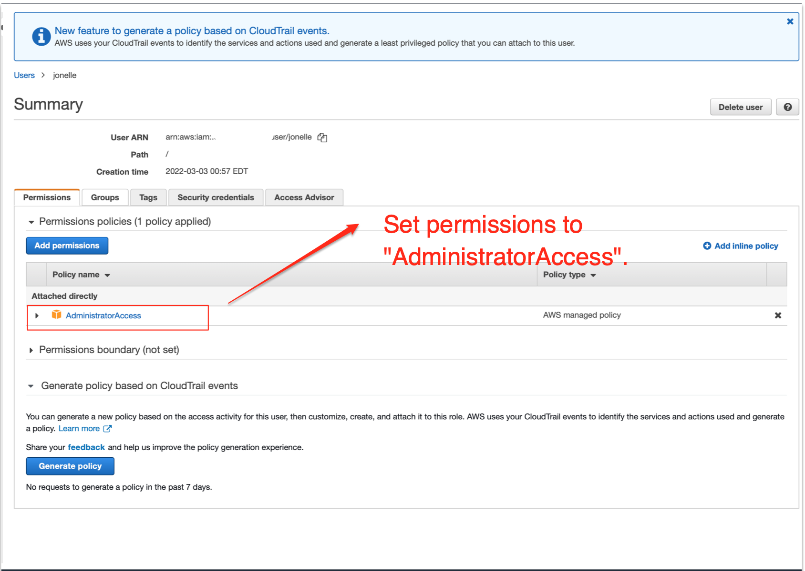

* Next, make sure that you have the latest version of [AWS CLI](hhttps://docs.aws.amazon.com/cli/latest/userguide/getting-started-install.html) installed.

```bash
$ aws --version
```

```bash
$ aws config
```
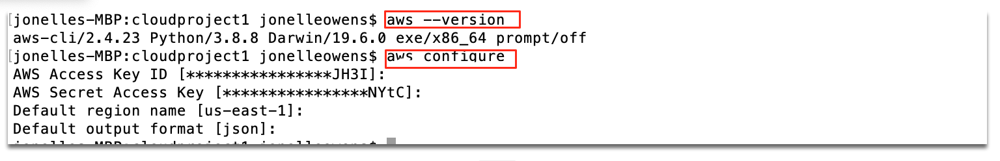

### Create **and configure an EKS cluster**
We will assume that you already have an Amazon EKS cluster up and running. If not, you can follow this [link](https://www.eksworkshop.com/030_eksctl/) to get started with Amazon EKS cluster setup.

* After signing in and setting your permissions, use the search bar to search for EKS. 
* Select "Add Cluster".
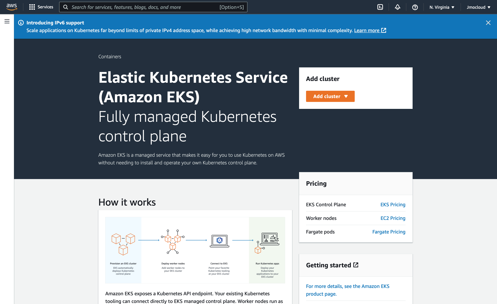
* Name your project and then select a role for your EKS Cluster. 
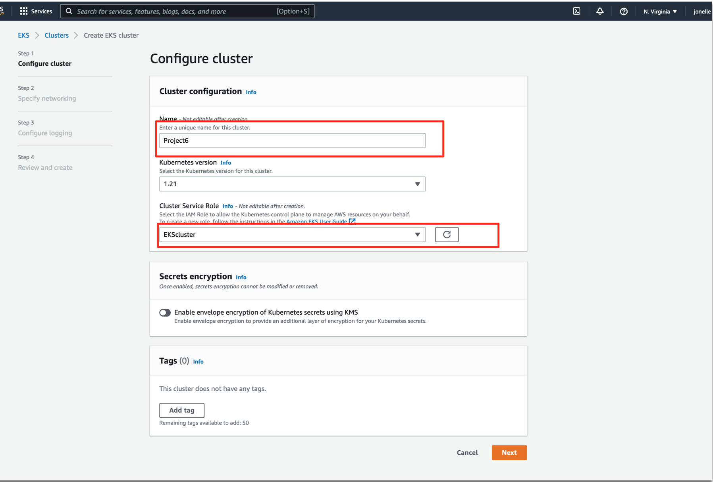
* Leave everything else under the default settings, select next, and then create.
* The status of the cluster witll show "creating". Once you refresh your window, you will see an "active" status. 
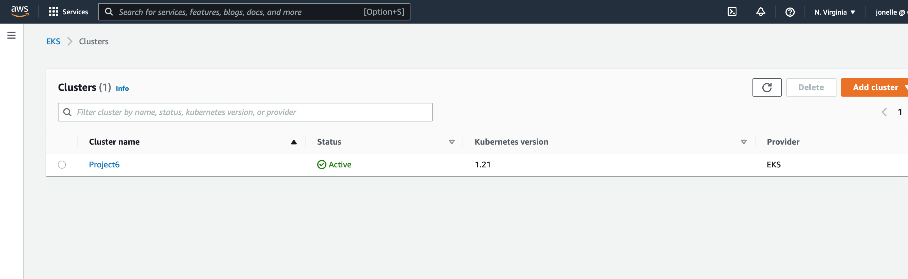
* Now, you will need to add permissions to the cluster by creating a nodegroup.

    --Navigate to the IAM service under the "Access Management" tab, select roles.

    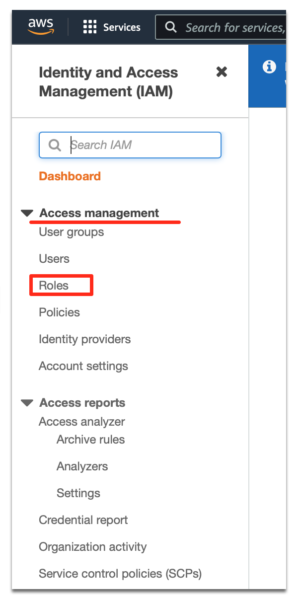


    --Select "Create Role".
        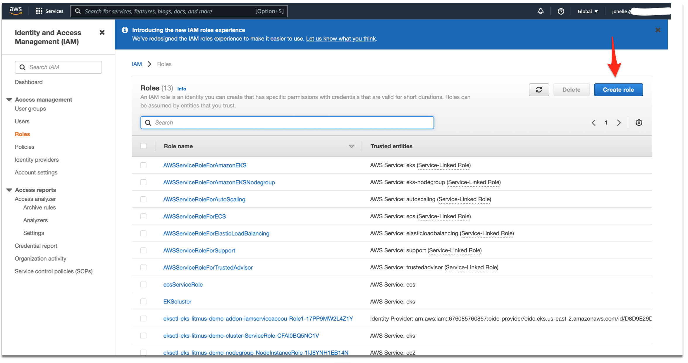


    --"AWS Service"

    --Then select "EC2, and "Next".

    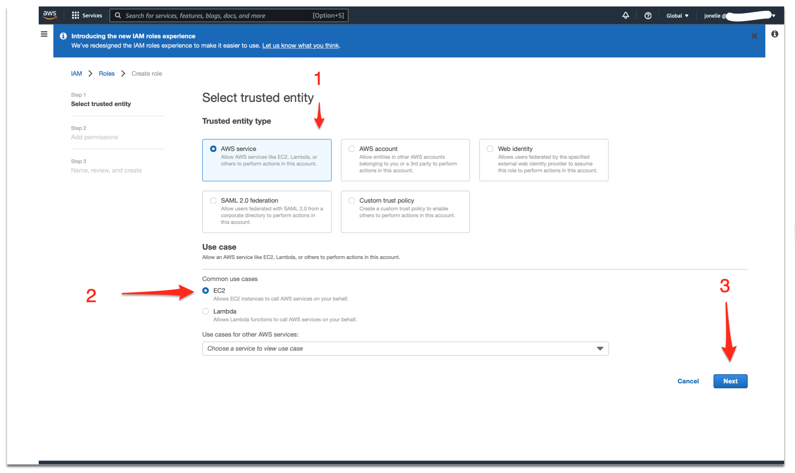


    --Add the following permissions
    * AmazonEKSWorkerNodePolicy
    * AmazonEKS_CNI_Policy
    * AmazonEC2ContainerRegistryReadOnly

    --The added permissions should show up on the next page. 

    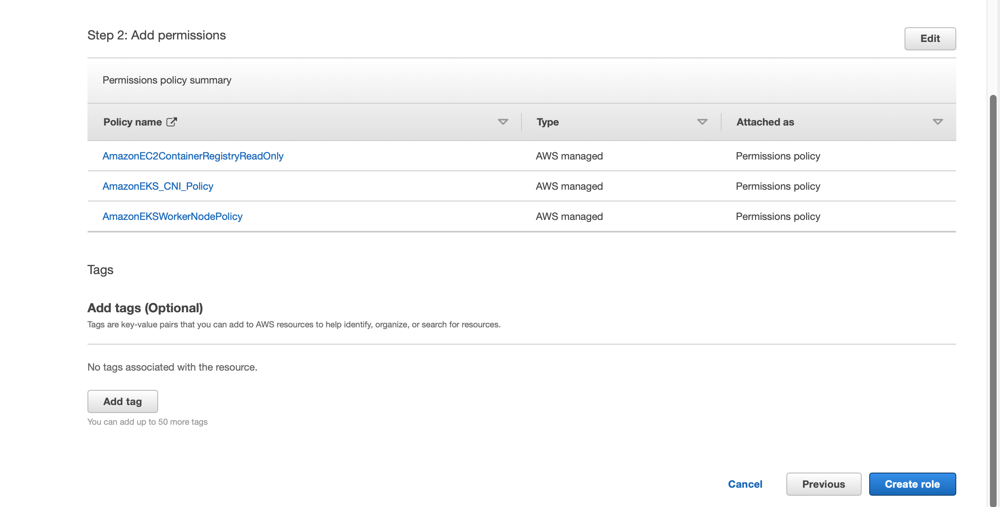


    --Select "Create".
    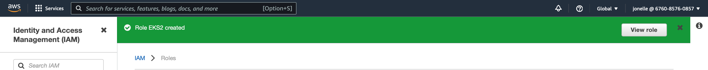

* Next, navigate back to the cluster on Amazon EKS; Click the "Configuration" tab; select the "Compute" tab and then select "Add Node Group."

    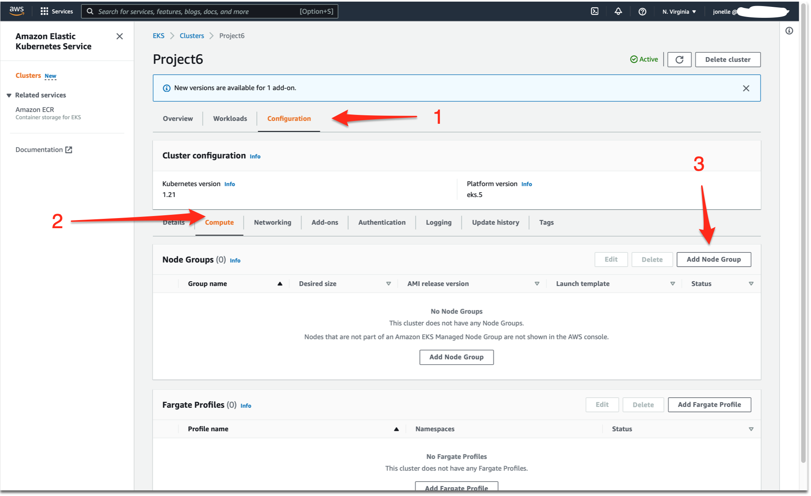
Next, name your new node group and select the "Node IAM Role", select "Next", and then "Create".
    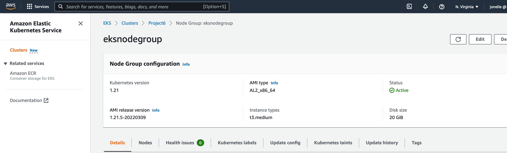
    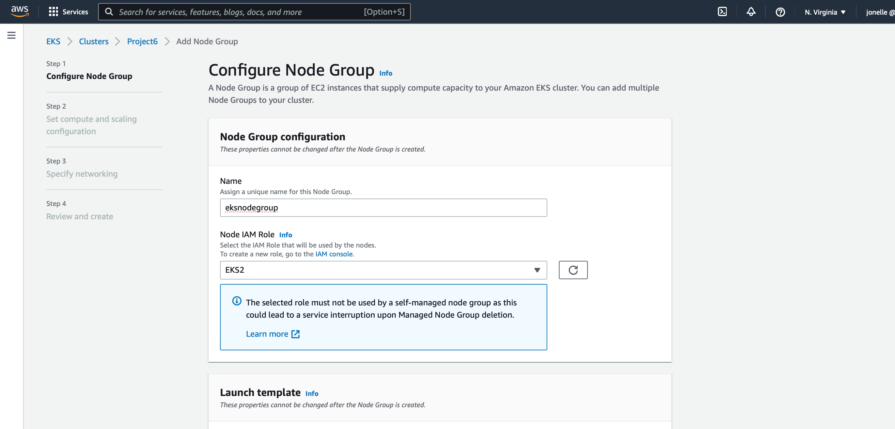

### Step 2. Create a Zebrium account and install the log collector

You’ll need a free Zebrium trial account (sign up [here](https://cloud.zebrium.com/auth/sign-up)). Create a new account, set your password and then advance to the Send Logs page.


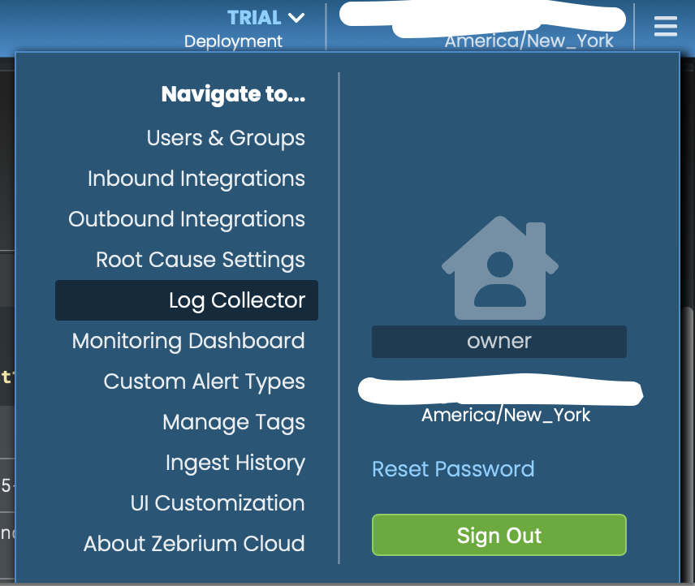
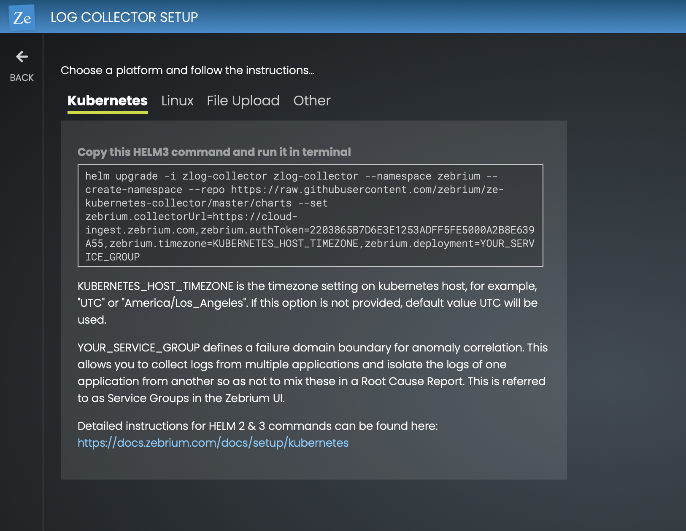

1. Copy the Helm command from the Zebrium Send Logs page.

**Important:** You can just delete this part of the line:

```bash
zebrium.timezone=KUBERNETES_HOST_TIMEZONE,zebrium.deployment=YOUR_DEPLOYMENT_NAME
```

See the example below (make sure to substitute XXXX for your actual token).

**Install the Ze log collector. Copy the cmds from your browser & make the above changes. Make sure you use the correct token and URL**

```bash

helm upgrade -i zlog-collector zlog-collector --namespace zebrium --create-namespace --repo https://raw.githubusercontent.com/zebrium/ze-kubernetes-collector/master/charts --set zebrium.collectorUrl=https://cloud-ingest.zebrium.com,zebrium.authToken=XXXX
```


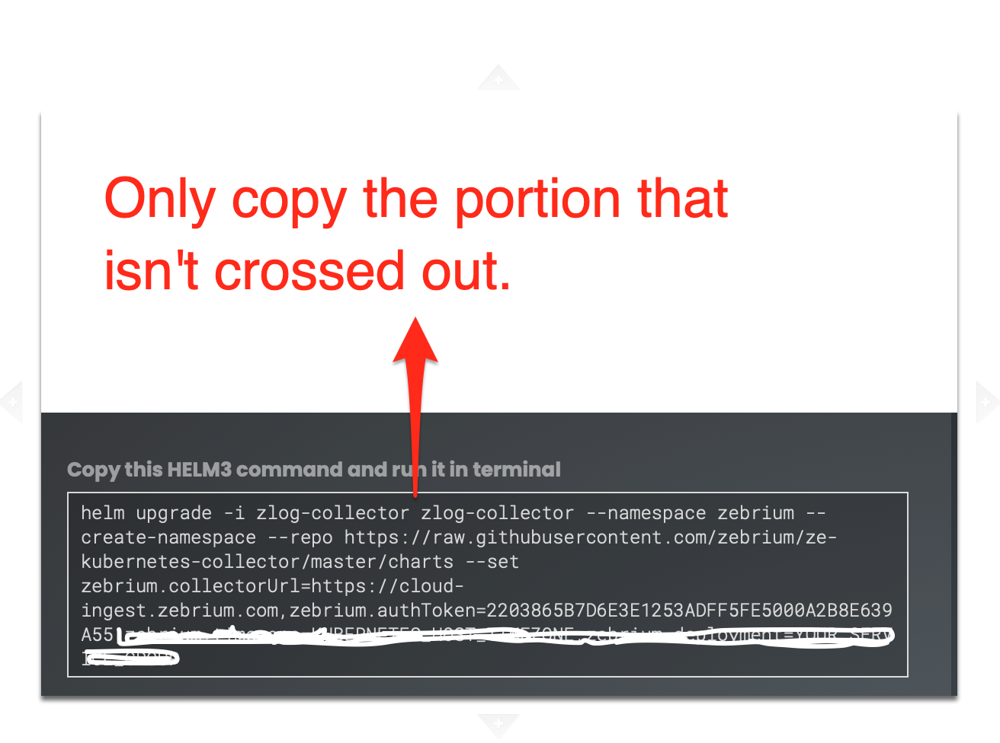

Past the command in your terminal. 
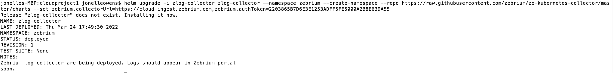
Next, navigate to the the Zebrium portal and you should see the below output. 
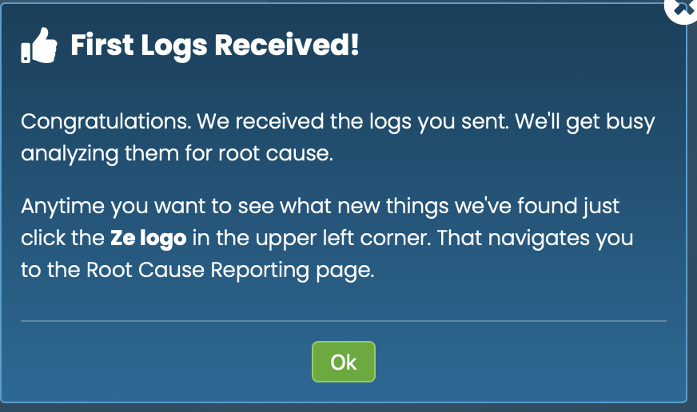

We’re now done with the Zebrium installation and setup. The machine learning will begin structuring and learning the patterns in the logs from your newly created K8s environment.

**Important:** Do not install the log collector yet as we’re going to modify the install command!

### Step 3. Install and fire up the Sock Shop demo app

[Sock Shop](https://microservices-demo.github.io/) is a really good demo microservices application as it simulates the key components of the user-facing part of an e-commerce website. It is built using Spring Boot, Go kit, and Node.js and is packaged in Docker containers. Visit [this GitHub page](https://github.com/microservices-demo/microservices-demo/blob/master/internal-docs/design.md) to learn more about the application design.

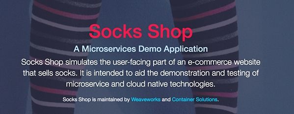

A little bit later, we’re going to install and use the [Litmus Chaos Engine](https://litmuschaos.io/) to “break” the Sock Shop application. So, we are going to install Sock Shop using a YAML config file that contains annotations for the Litmus Chaos Engine.

# Install Sock Shop from yaml. This version of the yaml has Litmus chaos annotations.

```bash
$ kubectl create -f https://raw.githubusercontent.com/zebrium/zebrium-sockshop-demo/main/sock-shop-litmus-chaos.yaml
```

This will be your output:
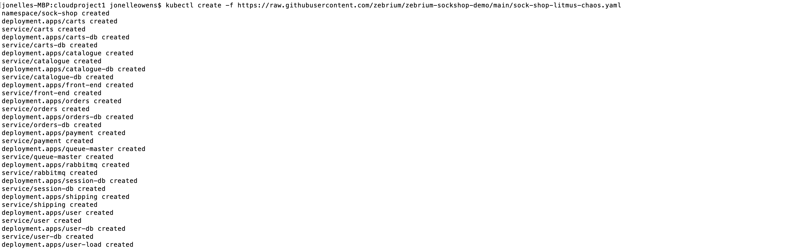

Now check the status of your pods. You can run the command a few times until you see that all pods are in a running state. 

```bash
$ kubectl get pods -n sock-shop
```

Output: 
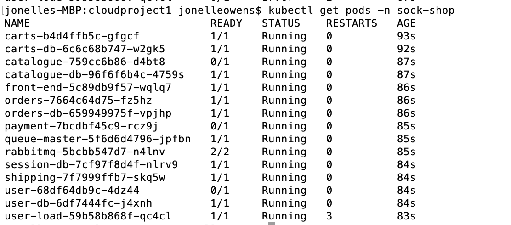

When all the services are running, you can bring up the app in your browser. You will need to set up port forwarding and get the front-end IP address and port by running the command below. You should do this in a separate shell window.

#Get pod name of front-end

```bash
kubectl get pods -n sock-shop | grep front-end
```
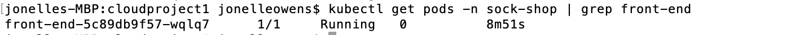


#Run port forward in a new shell window
#Use pod name from the above command in place of XXX’s
```bash
kubectl port-forward front-end-XXXX-XXXX 8079:8079 -n sock-shop
```
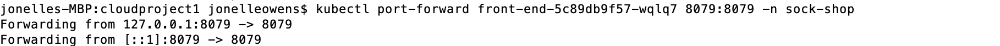


Now open the ip_address:port from above (in this case: 127.0.0.1:8079) in a new browser tab. You should now be able to interact with the Sock Shop app in your browser and verify that it’s working correctly.

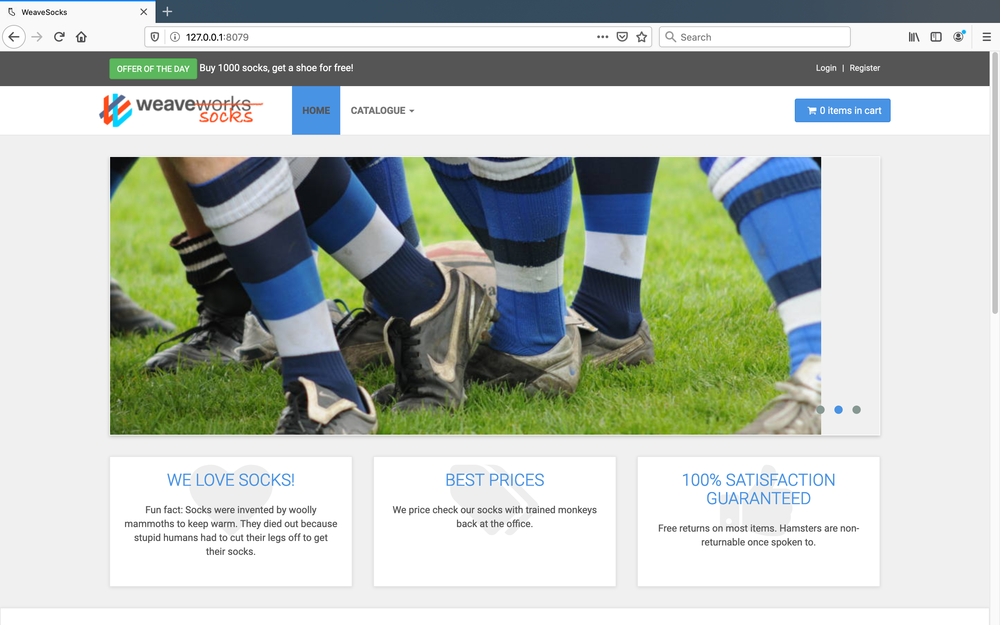

You can also go to CloudWatch in the AWS Console and visit the Resources page under Container Insights to verify that everything looks healthy. Details on how to do this can be found at the [Amazon CloudWatch User Guide](https://docs.aws.amazon.com/AmazonCloudWatch/latest/monitoring/deploy-container-insights-EKS.html).

### Step 4. Install the Litmus Chaos Engine

We’re going to use the open-source Litmus chaos tool to run a chaos experiment that “breaks” the Sock Shop app. Install the required Litmus components using the following commands:

**Install Litmus and create an appropriate RBAC role for the pod-network-corruption test**

```bash
$ helm repo add litmuschaos https://litmuschaos.github.io/litmus-helm/
```
```bash
$ helm upgrade -i litmus litmuschaos/litmus-core -n litmus --create-namespace
```
```bash
$ kubectl apply -f "https://hub.litmuschaos.io/api/chaos/1.13.6?file=charts/generic/experiments.yaml" -n sock-shop
```
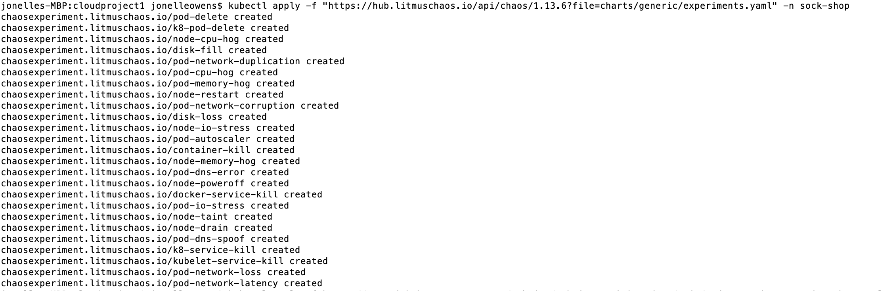

Setup service account with the appropriate RBAC to run the network corruption experiment

```bash
$ kubectl apply -f https://raw.githubusercontent.com/zebrium/zebrium-sockshop-demo/main/pod-network-corruption-rbac.yaml
```
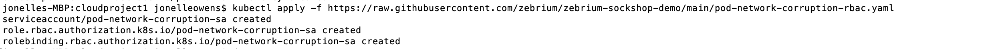

Make a note of the time

```bash
$ date
```
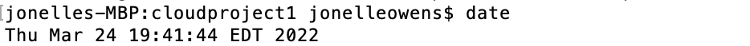

### Step 5. Do something else for two hours!

This is a new EKS cluster and a new app and Zebrium account, so it’s important to give the machine learning a bit of time to learn the normal log patterns. We recommend waiting at least **two hours** before proceeding (you can wait longer if you like).

You can use this time to explore the Zebrium UI.

On the REPORTING page, you should see at least one sample root cause report.

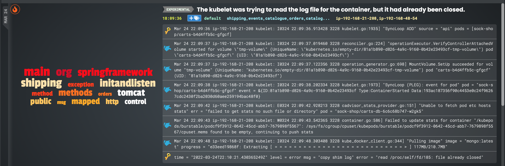

Select it and explore how to interact with Root Cause Reports! Make sure you try “peeking” and zooming into Related Events.

You might also see other real root cause reports. If you do, they are likely due to anomalous patterns in the logs that occur during the bring-up of the new environment (Zebrium sees them as being anomalous because it doesn’t have much history to go on at this stage). Again, feel free to poke around.

### Step 6. Run a network corruption chaos experiment to break the Sock Shop app.

Now that the ML has had a chance to get a baseline of the logs, we’re going to break the environment by running a Litmus network corruption chaos experiment.

The following command will start the network corruption experiment:

* Run the pod-network-corruption test.

```bash
$ kubectl apply -f https://raw.githubusercontent.com/zebrium/zebrium-sockshop-demo/main/pod-network-corruption-chaos.
```
* Make a note of the date, ensuring that 2 hours has elapsed since the last time stamp.

```bash
$ date
```
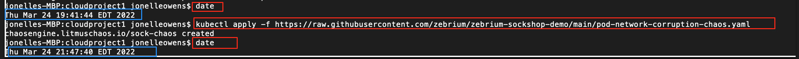

It will take a minute or so for the experiment to start. You can tell that it’s running when the pod-network-corruption-helper goes into a Running state.  Monitor its progress with kubectl (the -w option waits for output, so hit ^C once you see that everything is running):

* Watch the output until pod-network-helper goes into Running state.

```bash
$ kubectl get pods -n sock-shop -w
```
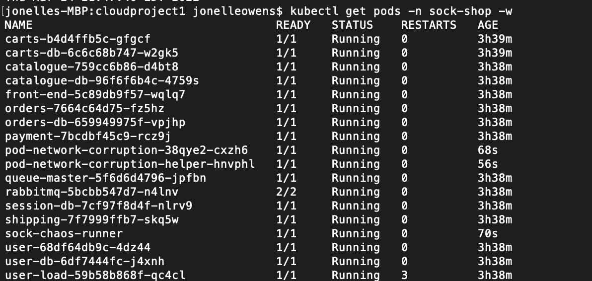

Once the chaos test has started running, you can go to the Sock Shop UI. You should still be able to navigate around and refresh the app but might notice some operations will fail (for example, if you add anything into the shopping cart, the number of items does not increment correctly). The chaos test will run for two minutes. Wait for it to complete before proceeding to the next step.

In my case, I did not have a shopping cart. 
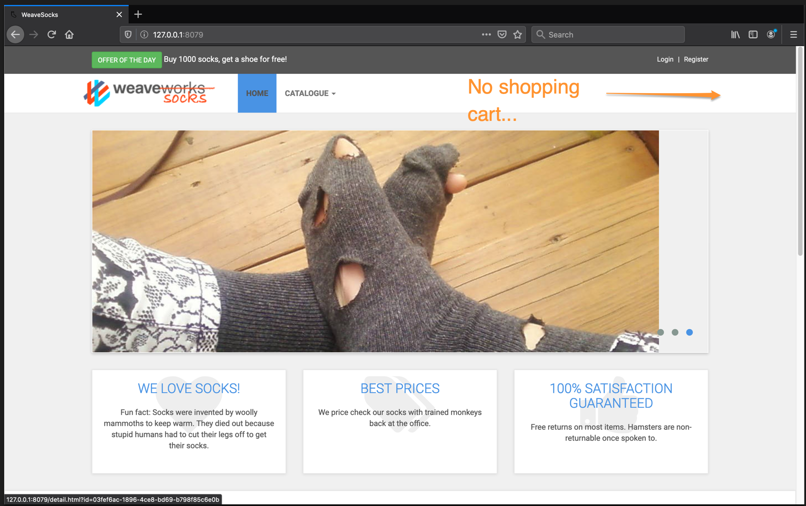

### Step 7. The results and how to interpret them

Please give the machine learning a few minutes to detect the problem (typically 2 to 10 minutes) and then refresh your browser window until you see one or more new root cause reports **(UI refresh is NOT automatic)**.

I tried the above procedure several times and saw really awesome results after each run. However, the actual root cause reports were different across runs. This is because of many factors, including the learning period, what events occurred while learning, the timing and order of the log lines while the experiment was running, other things happening on the system, and so on.

There are three useful parts of the summary:

**Plain language NLP summary** – This is an experimental feature where we use the [GPT-3 language model](https://www.zebrium.com/blog/using-gpt-3-with-zebrium-for-plain-language-incident-root-cause-from-logs) to construct a summary of the report. In this case, the summary is not perfect, but it gives us some useful context about the problem. We see something about a Chaos Engine and an order not being created in the allotted time.

**Log type(s) and host(s)** – Here you can see the host and log types (front end, events, orders, and messages) that contain the events for this incident.

**One or two log “Hallmark” events** – The ML picks out one or two events that it thinks will characterize the problem. In this example, we see a chaos event as well as an exception about an order timeout. Just from this, we get a good sense of the problem.

2. **Viewing the report details shows the root cause and symptoms**

Clicking on the summary lets you drill down into the details of the root cause report. Initially, you see only the core events. The core events represent the cluster of correlated anomalies that the ML picks out. There are many factors that go into anomaly scoring, but the most important ones are events that are either “rare” or “bad” (events with high severity).

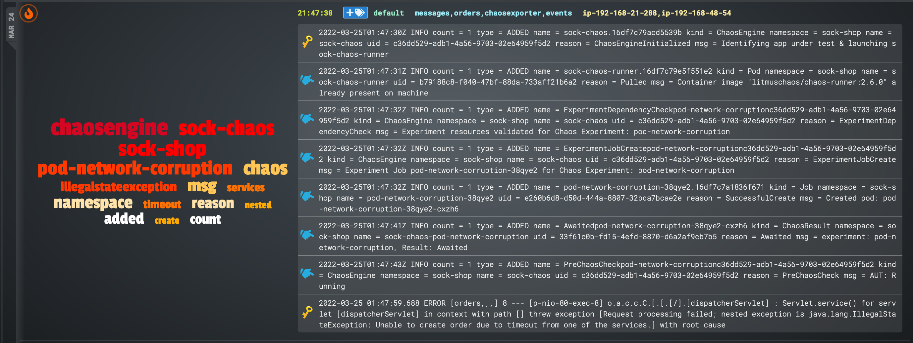

As you can see, there are many root causes as to why the website is not functioning properly. Zebrium was able to find and list 8 root causes with explanations.

### The End!

Now that we project has concluded, don't forget to delete your cluster and node groups, so that you will not be charged for extensive usage.


